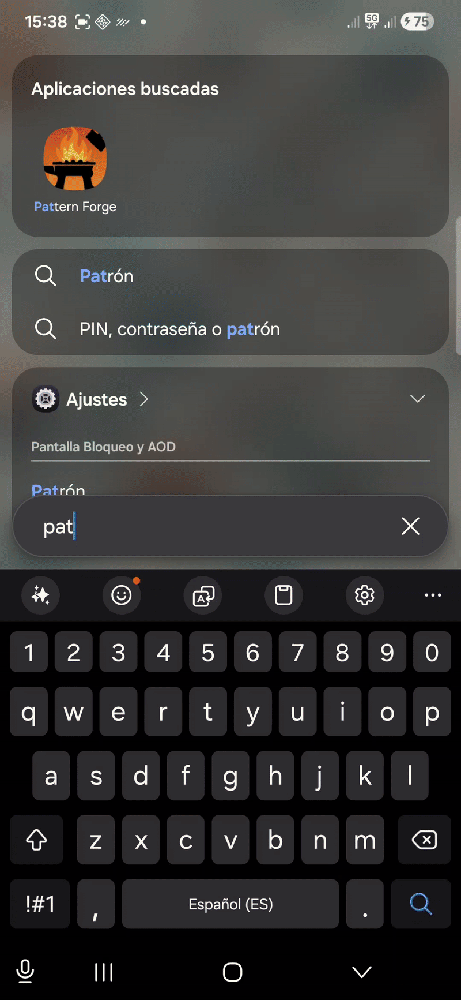
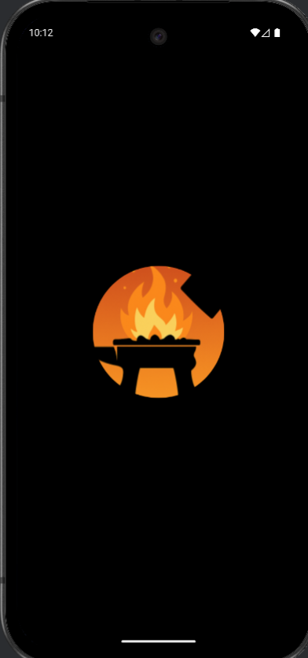
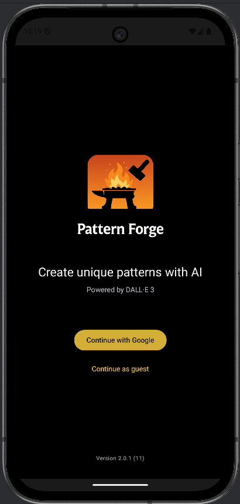
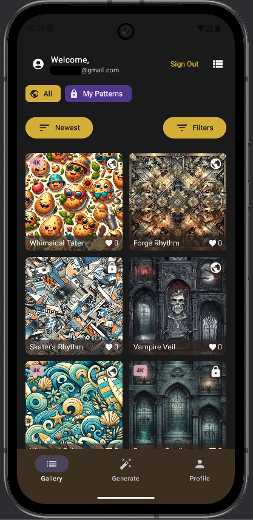
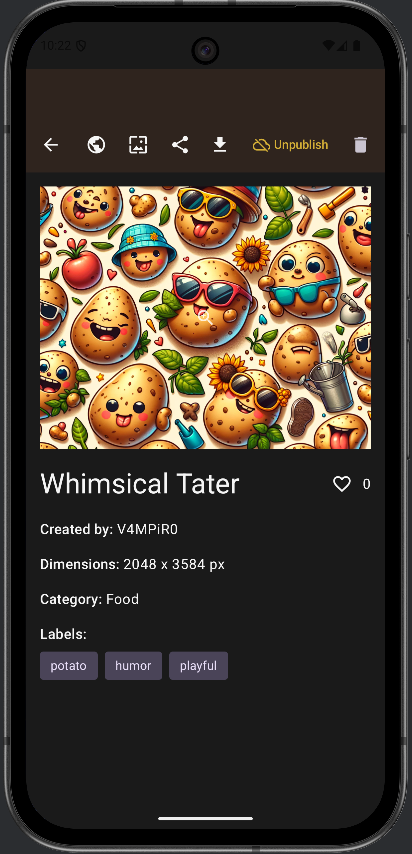
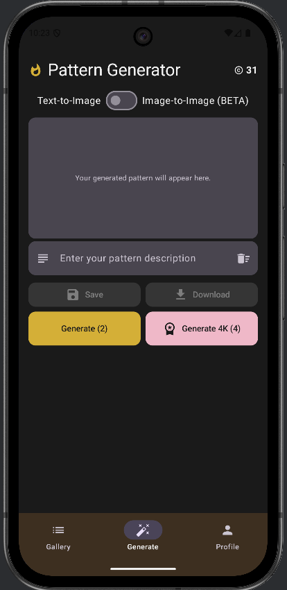
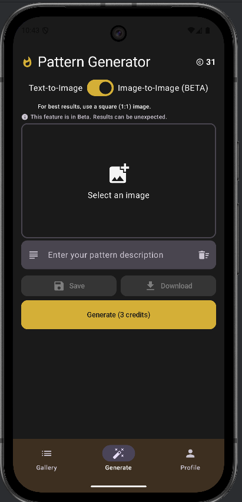

# Pattern Forge: Your Personal AI Design Studio

Welcome to the official space for Pattern Forge, the revolutionary Android application that puts the power of professional-grade artificial intelligence in your hands. Create, transform, and share stunning, unique patterns with just a few taps.

## Key Screens

| | | |
| :---: | :---: | :---: |
|  |  |  |
| *Community Gallery* | *Generate Screen* | *Pattern Detail View* |
|  |  |  |
| *Profile & In-App Purchases* | *Login Screen* | *Generated Result* |

## What is Pattern Forge?

Pattern Forge is more than just an image generator; it's your creative co-pilot. Built with a suite of cutting-edge AI models, our app provides a seamless and intuitive experience for artists, designers, and creators of all levels. Whether you have a clear vision or just a spark of an idea, Pattern Forge gives you the tools to bring it to life in spectacular detail.

Our philosophy is simple: professional AI tools should be accessible to everyone. That's why we've integrated industry-leading technologies into a clean, modern, and user-friendly interface.

## ✨ Core Features

- **Advanced Text-to-Image Generation**: Simply describe your vision, and our powerful DALL-E 3 integration will translate your words into a high-quality, ready-to-use pattern. The only limit is your imagination.

- **Revolutionary Image-to-Image Transformation**: Have a photo you love? Upload it and watch it transform. Powered by Stable Diffusion, this feature allows you to apply new styles, concepts, and textures to your existing images, maintaining the core composition while creating something entirely new.

- **Stunning 4K Upscaling**: Don't settle for standard resolution. With our premium 4K generation feature, your creations are processed through a sophisticated upscaling model to produce ultra-high-definition results, perfect for printing, professional use, or simply as a breathtaking wallpaper.

- **Community Gallery & Discovery**: Dive into a vibrant gallery of patterns created by users from around the world. Get inspired, see what's trending with our sorting and filtering options (by most voted, newest, etc.), and share your own masterpieces with the community.

- **Seamless and Modern UI**: We believe a powerful tool doesn't need to be complicated. Every screen, button, and interaction has been meticulously designed to be intuitive, clean, and consistent, allowing you to focus on what matters most: your creativity.

## 🚀 Powered by Professional Integrations

Pattern Forge stands on the shoulders of giants. We've engineered our app to leverage a robust, scalable, and professional tech stack to deliver reliable, high-quality results:

- **OpenAI**: Harnessing the creative power of **DALL-E 3** for text-to-image generation and **GPT-4o-mini** for intelligent metadata tagging.
- **Stability AI**: Utilizing state-of-the-art **Stable Diffusion** models for our versatile Image-to-Image feature.
- **Microsoft Azure**: Providing a reliable and scalable cloud infrastructure for our AI services.
- **Supabase**: Powering our secure backend, user authentication, and database management.

## 🛡️ Your Data and Privacy

We are committed to protecting your privacy and being transparent about how we handle your data. Our application is designed to be secure and respectful of your information.

For a detailed explanation of what data we collect and how we use it, please review our **[Privacy Policy](https://github.com/v4mpir0ck/android-pattern-forge-public/blob/main/PRIVACY.md)**. You can also find information regarding our account deletion process **[here](https://github.com/v4mpir0ck/android-pattern-forge-public/blob/main/ACCOUNT_DELETION.md)**.

## 💬 Feedback & Contact

Pattern Forge is a project born from a passion for creativity and technology. Your feedback is invaluable to us. If you have ideas, suggestions, or encounter any issues, please don't hesitate to reach out or open an issue in this repository.

Thank you for being part of our creative community!
